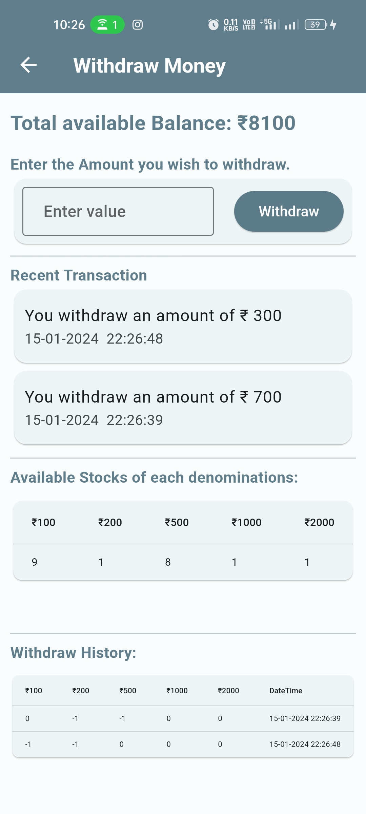

<h1 align="center">Virtual ATM machine App</h1>

  The Virtual ATM Machine app simulates the functionality of an ATM, allowing users to perform virtual cash insertion and withdrawal.

  
  
  

## Features

- **Virtual Cash Insertion:** Users can add virtual money by specifying the count of each denomination. Insertion history and the total available stock are displayed.

- **Balance Calculation:** The app calculates the total available balance based on the inserted note count.

- **Virtual Cash Withdrawal:** Users can withdraw money from the available balance. Withdrawal follows standard ATM machine conditions.

- **Withdrawal History:** The app maintains a history of withdrawal transactions, including details such as date, time, and amount.

- **Total Available Stock:** The total available stock of all note counts is displayed.

- **Last Three Withdrawal Transactions:** The app displays information about the last three withdrawal transactions.

## Dependencies
- sqflite: For performing CRUD operation data into local storage.
- flutter_bloc: For managing state of App.